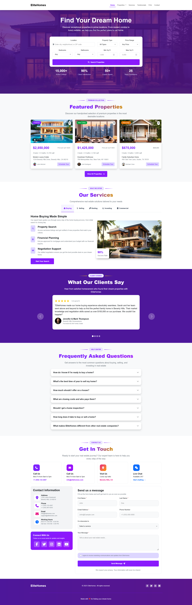

# Route Exam 1
Route Exam 1 for the Route Front-End course where I was under a tight deadline and needed applied responsive web design principles using Bootstrap, built a modern real estate landing page with reusable components, customized Bootstrap components with my own CSS, and created a responsive navigation system featuring a full-width mega menu while maintaining a clean and scalable code structure. This was submitted on May, 28th, 2026.
## Screenshot
